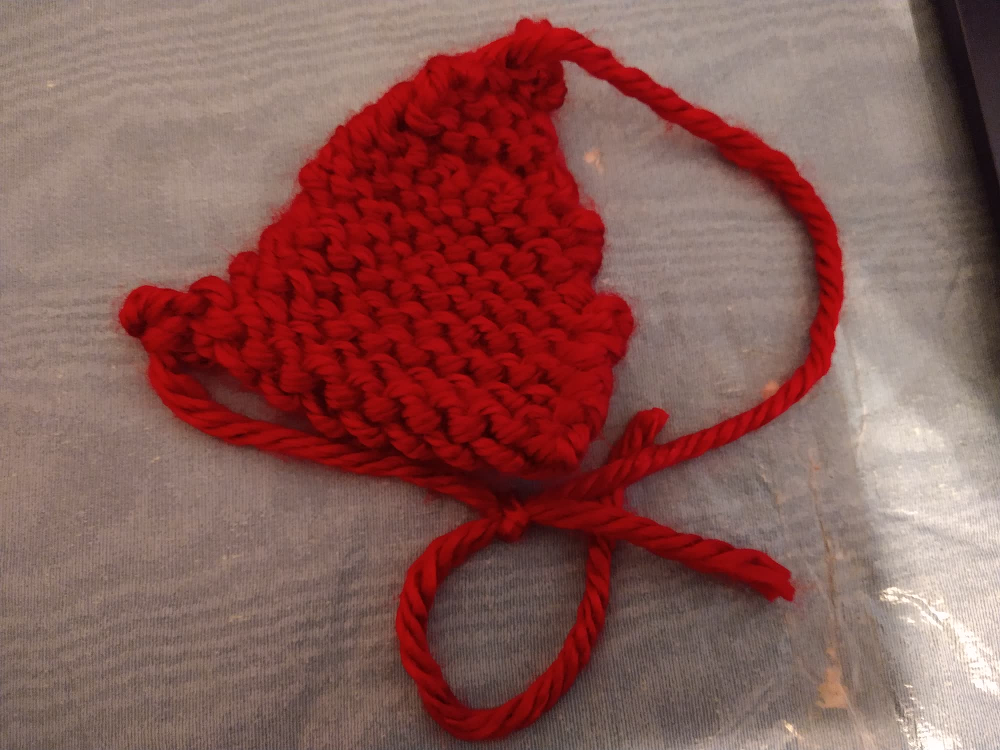

# New Algorithm??? 

Date: 11-20-2024

So I think I got the basic knitting motion in muscle memory now. Still need some help with tight knitting; apparently [fixing your posture](https://www.youtube.com/watch?v=6QhAMn7J1Ck) and loosening up in general is a valid strategy, might be a good excuse to actually have good posture lol. 

I misunderstood [this video](https://www.youtube.com/watch?v=VSwjIUiQZlM), and instead of doing what the video author is doing, e.g. 

(1 merge (2 merge (3 merge (4 .... ))))

I instead did 

((1 merge 2) (3 merge 4) (5 merge 6) (7 merge 8)) 

because I didn't realize that the type of stitch she just did was effectively the same basic stitch, just done differently. Maybe once I get more experience in knitting I'll be better able to reason about how these motions work lol. 

Ended up making a triangle looking thing

