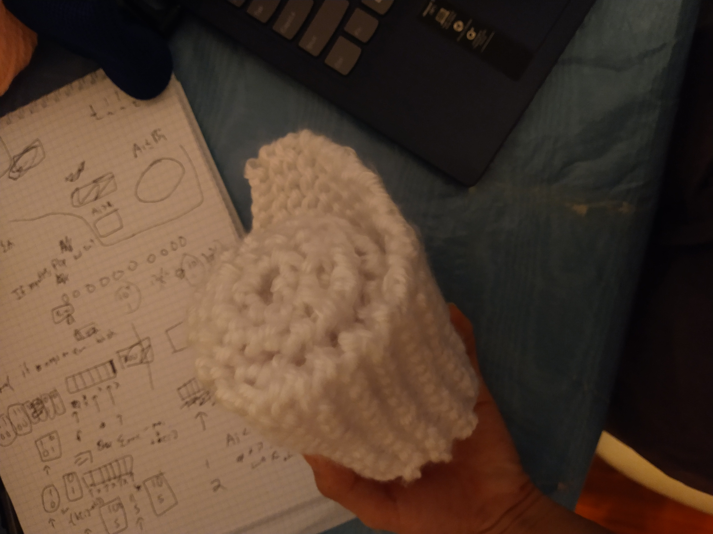

# Tips and made a Scarf!!!

Date: 11-27-2024 

I made a scarf! 

This was made over the course of watching the entirety of madoka magica, so about 4 hours of work? 

To get rid of tight knitting, the #1 thing for me at least is, right before you're about to pull off the stitch off the needle, pull perpendicular to the needle, before pulling the stitch off. If you look at the geometry, what this is simply doing is adding more yarn from your spool to the stitch. You can always knit tighter, but it's very hard to knit looser, so always opt for looseness.

(This probably is causing other issues, but again, I'd rather be too loose than too tight)

Also one thing I picked up is getting a better feel for stitches. After learning how to merge stitches, and ofc adding a row is easy, I can kind of start to make more interesting patterns that go in and out. It feels like I'm finally learning the primitives for real. 

That being said, I actually did all of this about a week ago. I stopped and had a hard relapse into Polytopia lol, just literally brainrotting for ~6 hours a day fighting the AI Bot. 

## Replacement activity

The intent for knitting was to be a replacement activity for things like polytopia if I want to do something truly mindless. Instead of braindead gaming while listening to youtube, maybe I'd knit and watch youtube instead. 

Then it just brought on "lol just don't do either just be productive" and I feel so... just disgusted all over again and end up crashing and burning anyways. Like what is wrong with me lol. 

## Posture

Ultimately knitting is not really that much healthier than programming - you can sit in the same place for hours, and you can start to hunch back and get back pain and such. 

## TL;DR 

The fundamental issue I guess is that whenever I'm feeling even a bit unsure or bad, my default reaction is to go actual degen mode. I've said this time and time again, doing literally nothing >>>> degen mode, but I end up doing it anyways. 

Doing nothing is kinda scary though. Like when I was 17, it was cool to not have answers and have my whole life ahead of me. Now that I'm 22, without a job (I probably have to learn some backend framework at this point), I'm feeling it. It's very interesting how much I deflect, aside from the obvious degen mode stuff, regret and anxiety constantly flood me (even if when I'm in a good mood it's mostly unjustified)

I will say, the one thing that I definitely have tangibly improved is that, given just a little bit of proper time, **most** of the time I can reset back down to some baseline level. It's been a constant struggle, but at least it's not like high school anymore. Definitely ICPC, competitive programming, that whole loop gave me a lot of confidence? Which is weird since like, bro, I don't know jack shit about programming, I completely bombed HRT, etc. I guess it's more like, I had a fun time and did something I always wanted to do? Even if objectively right now I have tons of things I could work on and could've worked on etc. but whatever man life's too short to dwell on that all the time 

I just hope that this innate confidence can carry me through some of my passion-ish ideas. For example, these notes! They're very much written in an online fashion without much revision at all.

## wtf 

Ahh whatever. Made a scarf.

I feel like since high school, I've had something I wanted to say but could never verbalize it. Here, I'm mostly saying garbage, I feel like what I'm saying right now doesn't even reflect 10% of what I'm really feeling, but attempting to verbalize it helps. 